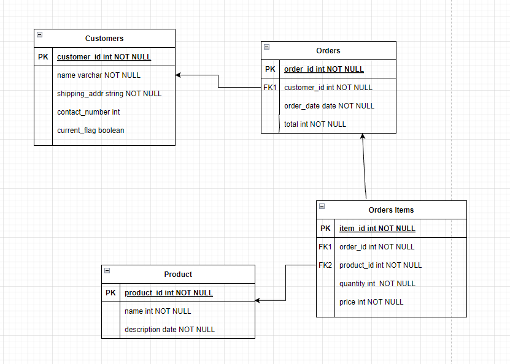

## Problem 1: Data Modelling

Imagine you are designing a database for an e-commerce platform. The database should store information about products, customers, orders, and order items. Each order can contain multiple order items, and each order item is associated with a specific product. Each customer can have multiple orders. Customer details such as shipping address, contact number etc. can change over time. We want to retain the historical information as well in our schema.

1. Design a **star-schema / snowflake schema model** for the above requirements
    1. Use an entity-relationship diagram (ERD) that represents the relationships between these entities
    2. Include the necessary attributes and primary/foreign key relationships. Briefly explain your design choices.
2. Generate and insert sample data in the above model. Include the process and code of generating random data in your submission. You data should have:
    1. At least 2 years of order history
    2. At least 10 products; at least 2 products with variants.
    3. At least 10 customers
  

## Solution

### 1. Data model

