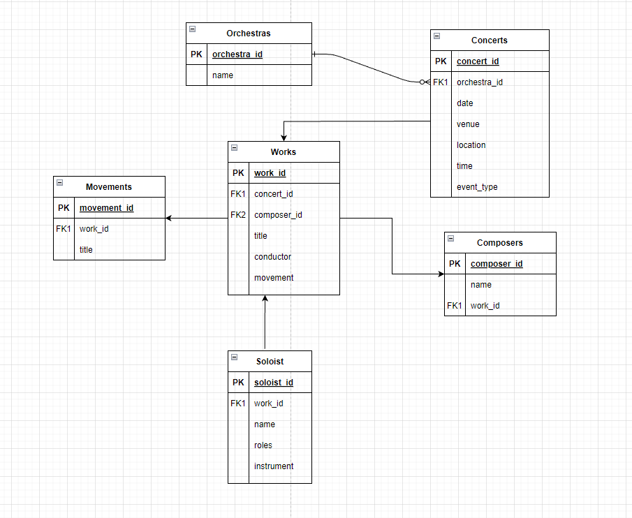

## Problem 3: ETL

The below given json file contains data related to orchestra, theirs concerts, works, artists, etc. Since the data is in nested JSON format, its not possible to conduct any analysis on the raw data.

[nested_data](https://s3-us-west-2.amazonaws.com/secure.notion-static.com/98b0fa4b-2a85-40e0-af20-5a2785c55c92/Untitled.json)

You are required to:

1. Load the data and perform transformations to simply the data and store it in a normalized manner into smaller tables which are easier to analyze
2. Prepare an ERD of the normalized data tables showing relationships between the various entities
3. Implement the transformation using python and SQL both and submit two separate solutions

## Solution

### 1. Load the data and perform transformations to simply the data and store it in a normalized manner into smaller tables which are easier to analyze
Solution can be found in `dataSimplify.ipynb` file.

### 2. Prepare an ERD of the normalized data tables showing relationships between the various entities

### 3. Implement the transformation using python and SQL both and submit two separate solutions
Python: Solution can be found in `dataSimplify.ipynb` file.

SQL: Solution can be found in `queries.sql` file.
